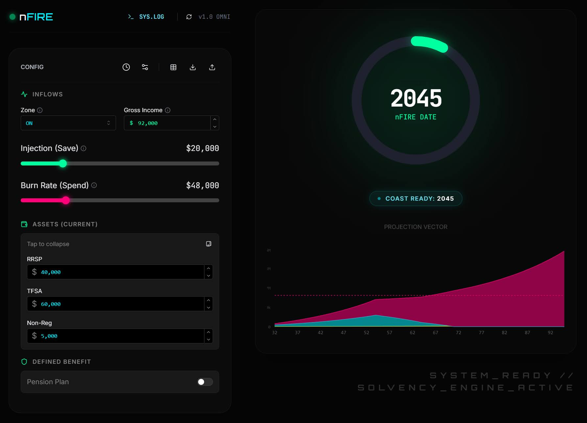

--- START OF FILE README.md ---

# 🌌 nFIRE: The Singularity Solvency Engine


> **nFIRE** is a deterministic financial independence engine. Unlike simple calculators that rely on the "4% Rule," nFIRE simulates your financial life year-by-year, strictly enforcing Canadian progressive tax brackets, RRSP meltdown strategies, and complex Defined Benefit pension vesting to determine your absolute solvency.

[**Live Demo**](https://shfqrkhn.github.io/nFIRE/)



---

## 📖 Table of Contents

1. [The Philosophy](#-the-philosophy)
2. [Features & Capabilities](#-features--capabilities)
3. [User Manual (Pilot's Handbook)](#-user-manual-pilots-handbook)
   - [Onboarding](#31-onboarding-the-welcome-mat)
   - [Core Workflow](#32-core-workflow)
   - [Advanced Configuration](#33-advanced-configuration-pensions--assumptions)
   - [Data Sovereignty](#34-data-sovereignty)
4. [Technical Manual (Engineer's Codex)](#-technical-manual-engineers-codex)
   - [Architecture](#41-architecture)
   - [The Physics Update (Maintenance)](#42-the-physics-update-maintenance)
5. [Installation & Deployment](#-installation--deployment)
6. [Troubleshooting](#-troubleshooting)

---

## 🧠 The Philosophy

Most FIRE (Financial Independence, Retire Early) calculators are **Stochastic** (Monte Carlo) or **Heuristic** (Rule of 25). nFIRE is **Deterministic**.

*   **Real Physics:** It calculates exact tax liabilities (Federal + Provincial) for every future year based on your specific withdrawal needs.
*   **Meltdown Logic:** It automatically prioritizes withdrawals (TFSA $\to$ Non-Reg $\to$ RRSP) to maximize tax efficiency.
*   **Solvency > Probability:** It does not give you a "95% chance of success." It gives you a binary Solvency result based on the parameters you define.
*   **Offline First:** Your financial data is sensitive. nFIRE is a Static PWA. Once loaded, it runs entirely in your browser's memory. **No data is ever sent to a server.**

---

## ⚡ Features & Capabilities

*   **Universal Solvency:** Supports **Service-Based Vesting** (GC, Military, Teachers). It dynamically calculates pension entitlement based on the specific retirement age being tested.
*   **Physics of Decay:** Real-dollar simulation enforces **Inflation Erosion** on non-indexed income streams and applies **OAS Recovery Tax (Clawback)**.
*   **Zero-Barrier UX:** Includes an automated "Welcome Mat" onboarding system and plain-English labeling.
*   **Progressive Web App (PWA):** Installable on iOS/Android; works offline.

---

## 🕹️ User Manual (Pilot's Handbook)

### 3.1 Onboarding (The Welcome Mat)
Upon first load, the **Welcome Mat** initializes. This heads-up display provides a high-level overview of the simulation controls. It creates a local storage flag (`nfire_welcome_seen`) to ensure it only appears once per device.

### 3.2 Core Workflow

The application interface is divided into the **Control Panel** (Left/Top) and **Telemetry** (Right/Bottom).

#### 1. Income & Location 🇨🇦
*   **Province:** Select your tax residency (ON, AB, BC, NS).
    *   *Why?* A retiree in Nova Scotia pays significantly more tax on RRSP withdrawals than one in British Columbia. The engine accounts for this exact "Tax Drag."
*   **Annual Income:** Your pre-tax annual salary.

#### 2. The Levers 💸
*   **Annual Savings (Injection):** How much you invest annually.
    *   *Auto-Sort:* The engine automatically fills tax-sheltered accounts first (TFSA $\to$ RRSP $\to$ Non-Reg).
*   **Retirement Spending (Burn Rate):** Your desired **after-tax** spending in retirement.
    *   *The Demand:* This is the net cash the engine must produce every year until age 95.

#### 3. Assets (Current) 🏦
Expand the accordion to enter current balances:
*   **RRSP:** Registered Retirement Savings Plan.
*   **TFSA:** Tax-Free Savings Account.
*   **Non-Reg:** Taxable Investment Accounts / Corp.

#### 4. Telemetry 📡
*   **The Reactor:** A radial gauge showing progress toward freedom.
*   **nFIRE Date:** The year you become fully solvent (work becomes optional).
*   **Coast Ready:** The year you can stop *saving* money, assuming you continue to work just enough to cover your daily costs.

### 3.3 Advanced Configuration (Pensions & Assumptions)

#### 🛡️ Defined Benefit Pensions
Click the **Shield Icon** to configure pensions. Supports two modes:
1.  **Fixed Amount:** For private annuities. Enter annual amount and start age.
2.  **Service Formula:** For Public Sector/GC. Enter **Career Start Age**, **Best 5-Year Avg**, and **Accrual Rate**.
    *   *Logic:* The engine calculates the pension value dynamically based on the retirement age being tested in the solvency loop.

#### ⏱️ Timeline & Assumptions
*   **Timeline:** Adjust Current Age and Target Retirement Age (for visual projection).
*   **Assumptions:** Tweak **Real Growth Rate** (Default: 5%) and **Tax Drag**.

### 3.4 Data Sovereignty
*   **Save:** Click the ⬇️ (Download) icon to save your profile as a `.json` file.
*   **Load:** Click the ⬆️ (Upload) icon to restore a session.
*   **Report:** Click the 📄 (Table) icon to export a CSV of your year-by-year net worth.
*   **Reset:** Click the 🔄 (Refresh) icon to factory reset the simulation.

---

## 🛠️ Technical Manual (Engineer's Codex)

### 4.1 Architecture
The app is a "Static Stack" PWA built for longevity and security.
*   **Framework:** React 18 + Vite.
*   **State Management:** Zustand + Dexie (IndexedDB) for persistence.
*   **Logic Core:** The solvency loop and tax calculation logic (compiled in `assets/`). *Note: Source code is not included in this distribution artifact.*
*   **UI:** TailwindCSS + Mantine + Framer Motion.

### 4.2 The Physics Update (Maintenance)
**Frequency:** Annual (January)
**File:** `src/data/rules_2025.json` (Source repository only)

nFIRE uses **Real Dollars** (Inflation-Adjusted). The 2025 tax rules act as a valid mathematical proxy for future years. However, to update precision, the source code must be modified and rebuilt.

1.  **Source Data:** Search for updated "Federal/Provincial Tax Brackets" and "TFSA Limits".
2.  **Update Constants:**
    ```json
    "constants": {
      "rrsp_limit_pct": 0.18,
      "rrsp_max_dollar": 32490, 
      "tfsa_limit": 7000
    }
    ```
3.  **Update Brackets:** Edit the `threshold` values in the `federal` and `provinces` objects.

---

## 💻 Installation & Deployment

### Artifact-Only Repository
This repository contains **compiled build artifacts only**. The source code is not included.

### Local Preview
To test the application locally, serve the current directory with a static HTTP server:

```bash
# Using Python 3
python3 -m http.server 8000
```

Then open `http://localhost:8000` in your browser.

### Deployment
The contents of this repository are ready for deployment to any static host (GitHub Pages, Netlify, Vercel, S3). No build step is required.

---

## 🔮 Troubleshooting

| Symptom | Probable Cause | Solution |
| :--- | :--- | :--- |
| **"Insolvency Detected"** | Assets hit $0 before Age 95. | Increase savings, reduce spend, or enable Pension. |
| **"NEVER" displayed** | Net Worth is 0 and Spend > Income. | Save at least $1 to initialize the projection. |
| **"Trajectory Error"** | Infinite Horizon calculation failed. | Ensure growth rate is realistic (1-10%). |
| **Chart is Flat** | Scale issue. | Hover over the chart; the Y-axis auto-scales to your wealth. |
| **Import Failed** | Corrupt JSON. | Ensure you are loading a file generated by nFIRE. |

---

**[END OF FILE]**
