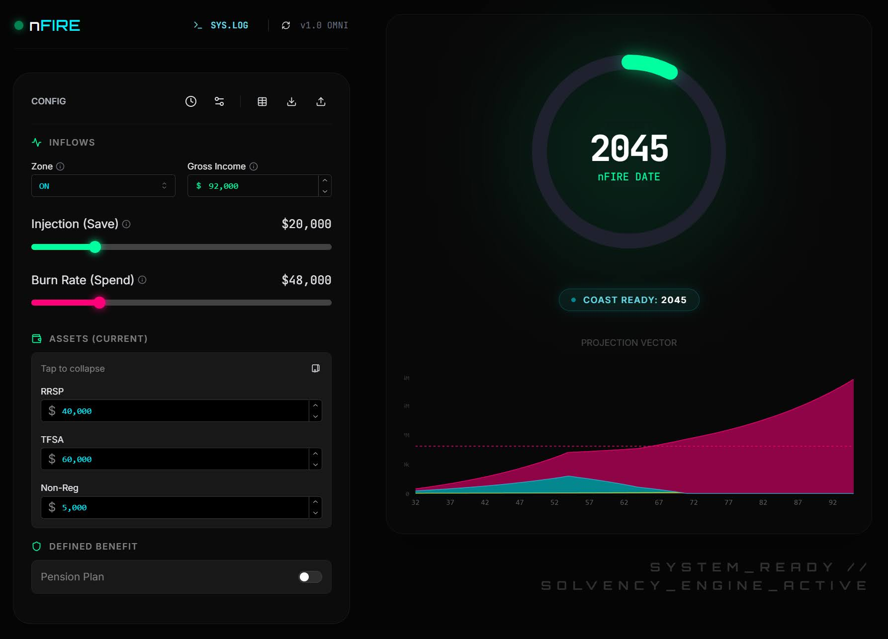

# nFIRE

<p><a href="https://github.com/sponsors/shfqrkhn?o=esb"><strong>Sponsor this project</strong></a></p>

Deterministic financial independence and solvency engine.

- **Status:** Active flagship
- **Version:** v10.1.40
- **Latest Release:** [GitHub latest release](https://github.com/shfqrkhn/nFIRE/releases/latest)
- **Live Demo:** [shfqrkhn.github.io/nFIRE](https://shfqrkhn.github.io/nFIRE/)
- **License:** MIT
- **Portfolio Role:** Finance and planning flagship.
- **Maintainer handoff:** [`docs/AI_MAINTAINER_HANDOFF.md`](./docs/AI_MAINTAINER_HANDOFF.md)
- **Release artifact policy:** [`docs/RELEASE_ARTIFACT_POLICY.md`](./docs/RELEASE_ARTIFACT_POLICY.md)

nFIRE models long-term financial independence with explicit year-by-year assumptions instead of hiding the plan behind a simple rule of thumb.

## Screenshot



## Why This Exists

Simple FIRE calculators often ignore tax brackets, pension timing, registered-account behavior, and sequence details. nFIRE aims to make those assumptions visible and testable for Canadian-style planning workflows.

## What It Does

- Projects financial solvency year by year.
- Supports structured assumptions for retirement, pensions, drawdowns, and taxes.
- Keeps planning data local to the browser.
- Provides a focused workflow for testing retirement feasibility.
- Offers installable/static app behavior through GitHub Pages.

## Quick Start

1. Open the live demo.
2. Enter the core household and financial assumptions.
3. Review the solvency output.
4. Adjust pension, retirement, and drawdown assumptions.
5. Save or export results according to the app workflow.

## Release And Local Use

- **Live/PWA:** Use the live demo in a modern browser and install it from the browser when available.
- **Local ZIP:** Download the latest release, extract it, and serve the extracted folder with a local static server:

```bash
python -m http.server 8080
```

Then open `http://localhost:8080/`. Use a local server instead of opening `index.html` directly, so browser module and service worker behavior match production.
- **Self-host:** Upload the release contents to any static host that serves the repository root.

## Privacy And Data Model

- Financial inputs stay local to the browser.
- No account or backend is required for normal use.
- Users should export or back up local data before clearing browser storage.

## Disclaimer

nFIRE is a planning aid only. It is not financial, investment, tax, legal, or retirement advice, and outputs are not guarantees.

## Relationship To Other Projects

nFIRE is the finance flagship. `TS-Dash` remains a stable time-series dashboard utility; finance-specific planning and solvency workflows belong here.

## Repository Layout

```text
.
├── index.html
├── assets/
├── scripts/
├── manifest.webmanifest
├── sw.js
└── screenshot-main.png
```

## Deployment

Host the repository root on GitHub Pages. The app is static and can also be previewed locally with a simple HTTP server.

## Quality Gates

```bash
npm test
bash scripts/verify_artifact_consistency.sh
```

## Maintenance

Keep financial assumptions explicit, version visible changes, and avoid implying regulated financial advice. Treat outputs as planning aids, not guarantees.

## License

See `LICENSE`.
